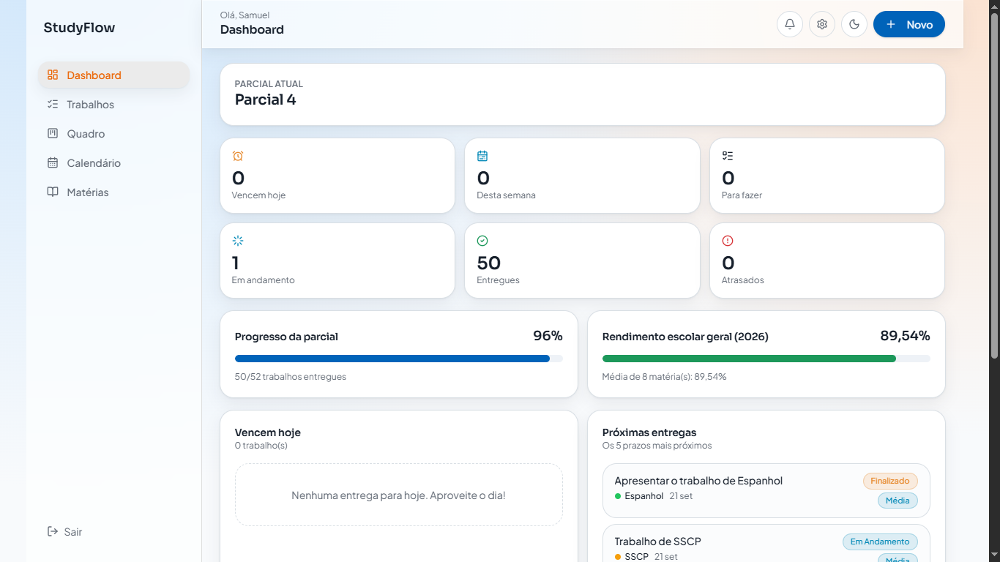
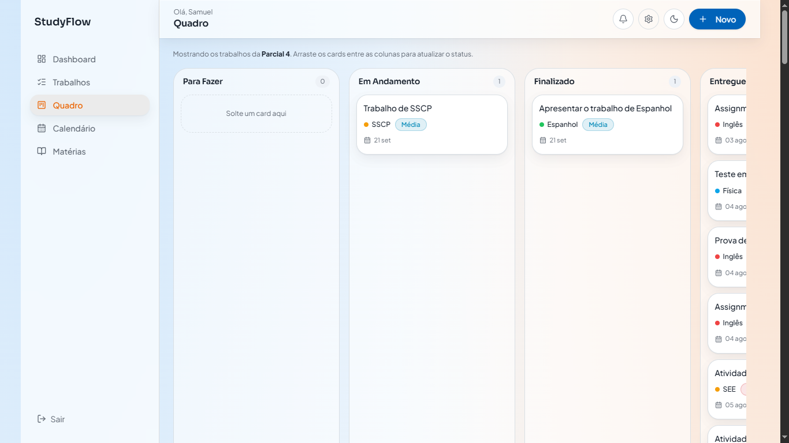
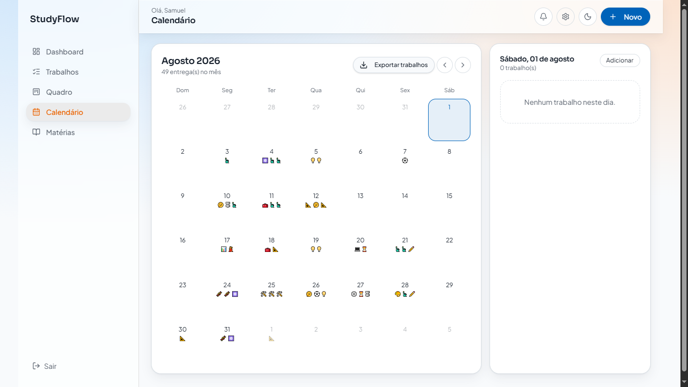
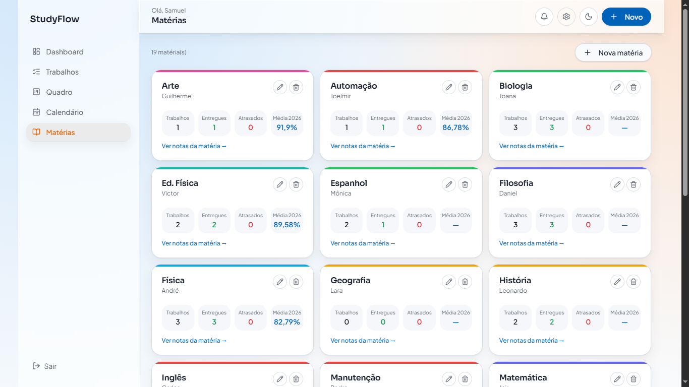

  

# StudyFlow

### Organização acadêmica, produtividade e colaboração entre colegas em um só lugar.

O **StudyFlow** é uma plataforma desenvolvida para ajudar estudantes a organizarem sua rotina acadêmica de forma mais prática, visual e colaborativa.

 

---

## Sobre o projeto

O **StudyFlow** foi criado com o objetivo de facilitar a organização acadêmica e aumentar a produtividade dos estudantes.

Mais do que uma ferramenta individual, o projeto também funciona como um **ambiente de colaboração entre colegas**, permitindo compartilhar trabalhos, organizar informações da turma e ajudar outros alunos no acompanhamento das atividades e compromissos escolares.

A proposta é reunir, em um só lugar, recursos que normalmente ficam espalhados em diferentes ferramentas, tornando a experiência mais prática, intuitiva e eficiente.

---

## Principais funcionalidades

- 📊 **Dashboard acadêmico** para visualização geral das informações
- ✅ **Organização de tarefas e trabalhos**
- 🗂️ **Quadro no estilo Trello** para acompanhamento visual das atividades
- 📅 **Calendário** para compromissos, prazos e planejamento
- 📚 **Área de matérias** para centralização das disciplinas
- 🤝 **Ambiente colaborativo** para compartilhamento de trabalhos e apoio entre colegas
- 🎯 Recursos voltados à **produtividade e organização acadêmica**

---

## Interface do sistema

<table>
<tr>

<td width="50%" align="center">

### Dashboard

Visão geral das principais informações acadêmicas e organização do sistema.

</td>

<td width="50%" align="center">

### Quadro

Organização visual de tarefas, trabalhos e andamento das atividades.

</td>

</tr>

<tr>

<td width="50%" align="center">

### Calendário

Planejamento de compromissos, datas importantes e prazos acadêmicos.

</td>

<td width="50%" align="center">

### Matérias

Espaço dedicado à organização das disciplinas e acompanhamento acadêmico.

</td>

</tr>
</table>

---

## Objetivo

O principal objetivo do **StudyFlow** é oferecer uma plataforma que ajude estudantes a:

- se organizarem melhor;
- acompanharem tarefas e prazos;
- centralizarem informações acadêmicas;
- colaborarem com colegas;
- compartilharem trabalhos;
- aumentarem a produtividade no dia a dia escolar.

---

## Tecnologias

---

## Acesse o projeto

O StudyFlow está disponível online:

### [🌐 Acessar StudyFlow](https://studyflow-br.lovable.app)

